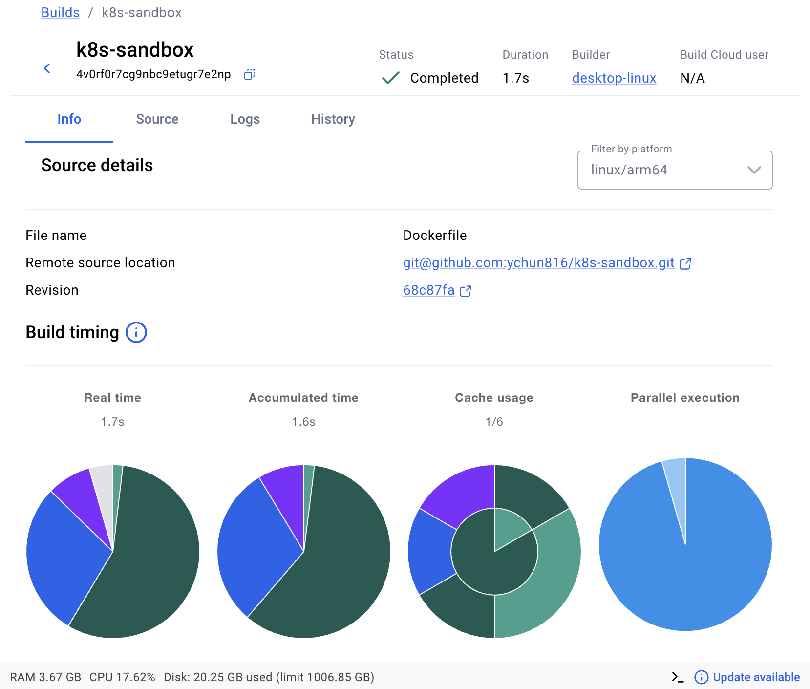

# TODO

Learning path for this sandbox. The point is to build every piece by hand and be
able to explain *why* it exists — so these are tasks, not answers. Where a step
says "figure out", resist looking up a finished manifest; `kubectl explain` and
`--help` are the intended route.

Order matters. Each stage produces something the next one needs.

**Scope.** Stages 1-8 are the whole sandbox: basic kind setup and deployment,
finishing when your own image serves traffic through an Ingress and you can
diagnose each layer when it breaks. Helm, GitOps, CI and observability are
filmory's phases, not stages here — see [where this ends](#where-this-ends).

## index
Stage 1: [prepare the tools] Installs and pins `kind`, `kubectl`, and other tools
Stage 2: [create a default platform] Creates a default, single-node Kubernetes cluster
Stage 3: [design the platform] cluster exists => Creates a deliberate 3-node cluster from YAML
Stage 4: [run an application on it] one Pod exists, but nothing recreates it => Runs the `nginx` Pod inside the cluster
> placing a workload Pod inside the existing cluster, and Kubernetes chooses the node
Stage 5: Deployment manages Pods and recreates them
Stage 6: Service gives Pods a stable network address
Stage 7: Ingress exposes the Service externally


- [Stage 1 — Make the tools runnable](#stage-1--make-the-tools-runnable)
- [Stage 2 — A cluster the lazy way](#stage-2--a-cluster-the-lazy-way)
- [Stage 3 — A cluster you designed](#stage-3--a-cluster-you-designed)
- [Stage 4 — First Pod](#stage-4--first-pod)
- [Stage 5 — Deployment](#stage-5--deployment)
- [Stage 6 — Service](#stage-6--service)
- [Stage 7 — Ingress](#stage-7--ingress)
- [Stage 8 — Your own image](#stage-8--your-own-image)
- [Where this ends](#where-this-ends)

---

## Stage 1 — Make the tools runnable

`kind get clusters` fails right now with *"No version is set for shim: kind"*.
mise puts shims on `PATH`, not binaries — the tool is downloaded but no version
is selected, and the shim refuses to guess. Fixing this is stage 1.  **— done 2026-09-09**

- [x] Install `mise` CLI
```bash
curl https://mise.run | sh

# verify the install 
~/.local/bin/mise --version
# mise 2026.x.x
``` 
- [x] Run `mise ls` — see what is already downloaded
- [x] Run `which -a kubectl` — **there is more than one.** Something outside
      mise provides a kubectl too. Work out which wins and why
- [x] Pin versions for this directory (try `mise use kind@0.32.0`, then read the
      `mise.toml` it wrote — decide if you want the others pinned too)
- [x] Verify: `kind get clusters` exits clean with no output
- [x] Verify: `kubectl version --client` now matches what `mise ls` reports
- [x] write a script to check+download the needed tools 

**Why bother:** filmory pins the same way. A cluster built with one kubectl and
driven by another is a genuine source of weird failures, and pinning is what
makes the mismatch visible instead of mysterious.

## Stage 2 — A cluster the lazy way

Before writing any config, make the default cluster so you have something to
compare against. **This one is deliberately a single node** — no config file, no
workers. The three-node cluster is stage 3; the point here is to see what the
defaults give you, so the config you write next has something to differ from.

- [x] `kind create cluster --name k8s-sandbox`
- [x] `kubectl get nodes` — how many? What roles?
- [x] `docker ps` — **find your node in the list.** This is the whole idea of
      kind: a "node" is a Docker container
- [x] `docker exec -it k8s-sandbox-control-plane crictl ps` — the containers running
      *inside* the node. Note this is `crictl`, not `docker`
```bash
➜  k8s-sandbox git:(master) ✗ docker exec -it k8s-sandbox-control-plane crictl ps
CONTAINER           IMAGE               CREATED             STATE               NAME                      ATTEMPT             POD ID              POD                                                 NAMESPACE
e9a503ee3549f       fe81a497e85f1       5 minutes ago       Running             coredns                   0                   03b2296300bb1       coredns-589f44dc88-drsp8                            kube-system
a0162a73356c5       fe81a497e85f1       5 minutes ago       Running             coredns                   0                   81de1131088c4       coredns-589f44dc88-hp742                            kube-system
41e2f7c6e063b       3501a03785a84       5 minutes ago       Running             local-path-provisioner    0                   b217814aede3b       local-path-provisioner-855c7b7774-p88w2             local-path-storage
e3f50943475cf       f2ede2b789a61       6 minutes ago       Running             kindnet-cni               0                   7bb774f7d7771       kindnet-rx4k6                                       kube-system
65650b39bd2b5       01ad784c02283       6 minutes ago       Running             kube-proxy                0                   4002102753e9a       kube-proxy-r4rs9                                    kube-system
8cf057235f944       4923943f21256       6 minutes ago       Running             kube-apiserver            0                   2019d13415ab3       kube-apiserver-k8s-sandbox-control-plane            kube-system
d95758d134b75       39d983367f38c       6 minutes ago       Running             kube-controller-manager   0                   7408e699b97df       kube-controller-manager-k8s-sandbox-control-plane   kube-system
fc83e0a3a8a20       76e62361b06b5       6 minutes ago       Running             kube-scheduler            0                   dd8fd1c145b37       kube-scheduler-k8s-sandbox-control-plane            kube-system
469ca78e7b5ea       6da6ea097b384       6 minutes ago       Running             etcd                      0                   eb3aaec006069       etcd-k8s-sandbox-control-plane                      kube-system

What's next:
    Try Docker Debug for seamless, persistent debugging tools in any container or image → docker debug k8s-sandbox-control-plane
    Learn more at https://docs.docker.com/go/debug-cli/
```
- [x] Find the API server port: `docker ps` shows `127.0.0.1:5xxxx->6443`.
      Confirm it matches `kubectl config view --minify`
- [ ] `kind delete cluster --name k8s-sandbox` — **deliberately not run.** The
      cluster is kept for filmory work; teardown is `docker stop` instead.

**Answer before moving on:** why is the kubeconfig pointing at a random high port on localhost rather than at 6443?

## Stage 3 — A cluster customized/designed

**— done 2026-09-11**

Now write the config. Aim for 1 control-plane + 2 workers, and port mappings so
you can reach the cluster from your browser later without `port-forward`.

- [x] Read the [kind configuration docs](https://kind.sigs.k8s.io/docs/user/configuration/)
- [x] Write `clusters/k8s-sandbox.yaml` — set `kind: Cluster`, the apiVersion, and a
      `nodes:` list
- [x] Add `extraPortMappings` on the control-plane: container 80 → host 8080,
      container 443 → host 8443. **Note these are per-node, not per-cluster**
- [x] Add a `node-labels: ingress-ready=true` kubeadm patch on the control-plane.
      You will not use it until stage 7 — work out now what it is *for*
- [x] `kind create cluster --name k8s-sandbox --config clusters/k8s-sandbox.yaml`
- [x] verify:
```bash
# check existing clusters
kind get clusters

# check exsiting nodes (all)
kubectl get nodes -w

# check exisitng , specify a name
kind get nodes --name k8s-sandbox
```
- [x] Nodes come up `NotReady` then go `Ready`. Watch it: `kubectl get nodes -w`.
      **Figure out what has to start before a node is Ready**
- [x] `kubectl get pods -n kube-system` — identify what each one does. You should
      be able to name the API server, etcd, scheduler, controller-manager, DNS,
      the CNI and kube-proxy
- [x] **Version skew check** (same as filmory Phase 1): compare the node version
      kind reports against `kubectl version`. More than one minor apart means
      pinning the node image or moving kubectl's pin

## Stage 4 — First Pod

**— done 2026-09-11**

restart cluster 
```bash
open -a Docker

docker ps
kind get nodes --name k8s-sandbox
kubectl get nodes

kubectl run nginx --image=nginx
kubectl get pod -o wide
kubectl describe pod nginx
```


- [x] `kubectl run` a single pod imperatively — any small image
- [x] `kubectl get pod -o wide` — which node did it land on? Who chose?
- [x] `kubectl describe pod` — read the Events at the bottom, top to bottom.
      That list is the scheduling story
- [x] Now write it as YAML in `manifests/`. Use
      `kubectl run ... --dry-run=client -o yaml` to get a skeleton, then strip
      every field you cannot justify
> first generate a skeleton 
```bash
#  not create a Pod. It only prints YAML into the file
kubectl run nginx --image=nginx --dry-run=client -o yaml \
  > manifests/nginx-pod.yaml

# open the file 
code manifests/nginx-pod.yaml  ## -> seems not working  # vscode is not on PATH
open -a "Visual Studio Code" manifests/nginx-pod.yaml

# Validate the YAML => !! ONLY VALIDATE; NOT ADD AYTHING TO CLUSTER !! 
kubectl apply --dry-run=client -f manifests/nginx-pod.yaml


# manage pod frm yaml file
kubectl delete pod nginx
kubectl apply -f manifests/nginx-pod.yaml
kubectl get pod nginx -o wide

```

- [x] Add `resources.requests` and a `limits.memory`. **Work out what the
      scheduler does with `requests` that it does not do with `limits`**
> Verify resources in yaml -> Apply the manifest to the cluster -> Delete the standalone Pod -> Restore the Pod from YAML
```bash
# Verify resources are in the YAML file:
sed -n '1,30p' manifests/nginx-pod.yaml

# Confirm Kubernetes accepts the file without changing anything:
kubectl apply --dry-run=client -f manifests/nginx-pod.yaml

# Run the real apply command, without --dry-run:
# Expected : #pod/nginx configured
kubectl apply -f manifests/nginx-pod.yaml

# Verify that the Pod exists:
kubectl get pod nginx -o wide

# Verify the resources were actually stored on the Pod:
# Expected output: map[limits:map[memory:256Mi] requests:map[cpu:100m memory:128Mi]]
kubectl get pod nginx -o jsonpath='{.spec.containers[0].resources}{"\n"}'

# can also inspect it in the readable description:
kubectl describe pod nginx

# !!  Pod is mostly immutable after creation -> for Pod specification changes
# => should Delete the exisitng pod and then recreate it
kubectl delete pod nginx
kubectl apply -f manifests/nginx-pod.yaml
kubectl wait --for=condition=Ready pod/nginx --timeout=120s
```
- [x] `kubectl delete pod <name>` — note that nothing recreates it

**That last bullet is the entire argument for stage 5.** Don't skip it.

## Stage 5 — Deployment

- [x] Write a Deployment with 3 replicas
> example : [Kubernetes Deployment YAML: 3 examples and expert tips](https://octopus.com/devops/kubernetes-deployments/kubernetes-yaml/)
> verify:
```bash
kubectl delete deployment ngnix --ignore-not-found
kubectl apply -f manifests/base/ngnix/deployment.yaml
# Watch the rollout
kubectl rollout status deployment/nginx 
# Check the Deployment summary
kubectl get deployment nginx
# List the Deployment’s Pods
kubectl get pods -l app=nginx -o wide
```
- [ ] **NOT DONE** — Get the `selector` / `template.metadata.labels` right. Break
      it on purpose once and read the rejection — it is the most common mistake
> verfiy selector relationship:
```bash
kubectl get deployment nginx \
  -o jsonpath='{.spec.selector.matchLabels}{"\n"}'

kubectl get deployment nginx \
  -o jsonpath='{.spec.template.metadata.labels}{"\n"}'

# shows the ReplicaSet that the Deployment created automatically.
kubectl get replicasets
``` 
- [x] `kubectl get replicaset` -> shows the ReplicaSet that the Deployment created automatically.
- [x] Delete Pods and watch them return
> verify:
```bash
kubectl delete pod -l app=nginx
# Watch the replacement Pods
kubectl get pods -l app=nginx -w
```
- [x] `kubectl scale` to 5, then back
```bash
kubectl scale deployment nginx --replicas=5  # scale to 5
kubectl scale deployment nginx --replicas=3  # scale back to 3

# verify state
kubectl get deployment nginx
kubectl get pods -l app=nginx
```
- [x] Add a `readinessProbe`. Then break it (wrong port) and watch pods run but
      never become Ready. **Understand Running vs Ready before continuing**
- [x] Change the image tag, `kubectl rollout status`, then `kubectl rollout undo`

## Stage 6 — Service

- [x] Write a ClusterIP Service selecting your pods
- [x] Get `port` vs `targetPort` right — say out loud which is which
- [x] `kubectl get endpointslices -l kubernetes.io/service-name=<svc>` —
      **this is the first thing to check whenever a Service "doesn't work"**
> commands
```bash
# restart docker
open -a Docker
docker info
kind get nodes --name k8s-sandbox
kubectl get nodes

# dry run test
kubectl apply --dry-run=client \
  -f manifests/base/ngnix/service.yaml

# apply for real
kubectl apply -f manifests/base/ngnix/service.yaml
kubectl get service nginx
kubectl get endpointslices \
  -l kubernetes.io/service-name=nginx

```
- [x] Break the selector on purpose. Confirm the endpoint list goes empty and
      the Service still exists and still resolves
> checking commands
```bash
# 1. Confirm the working state => The EndpointSlice should contain the Pod IPs.
kubectl get pods -l app=nginx --show-labels
kubectl get service nginx
kubectl get endpointslices \
-l kubernetes.io/service-name=nginx

# 2. Break the selector => change selector setting to "selector: app: test"
# Edit service.yaml temporarily:
# selector:
#   app: test

# Apply the broken selector:
kubectl apply -f manifests/base/ngnix/service.yaml

# The Service still exists and keeps its ClusterIP:
kubectl get service nginx

# The EndpointSlice should now have no endpoints:
kubectl get endpointslices \
      -l kubernetes.io/service-name=nginx

# Create a temporary Pod for the DNS test:
kubectl delete pod dns-test --ignore-not-found
kubectl run dns-test \
      --image=busybox:1.36 \
      --restart=Never \
      --command -- sleep 3600
kubectl wait --for=condition=Ready pod/dns-test --timeout=120s

# DNS still resolves the Service name and returns its ClusterIP:
kubectl exec dns-test -- nslookup nginx
kubectl exec dns-test -- nslookup nginx.default.svc.cluster.local

# Restore service.yaml:
# selector:
#   app: nginx
kubectl apply -f manifests/base/ngnix/service.yaml

# Confirm the Pod endpoints return:
kubectl get endpointslices \
      -l kubernetes.io/service-name=nginx

# Clean up the temporary DNS test Pod:
kubectl delete pod dns-test

```
- [x] Exec into a pod and `curl` the Service by DNS name. Work out the full form
      (`<svc>.<namespace>.svc.cluster.local`) and why the short name also works
> test commands
```bash
# 1. Confirm the cluster and Pods
open -a Docker
docker info
kubectl config use-context kind-k8s-sandbox
kubectl get nodes
kubectl get pods -l app=nginx -o wide

# 2. Confirm the Service and endpoints

kubectl get service nginx
kubectl get endpointslices \
-l kubernetes.io/service-name=nginx
# apply app:ngnix
kubectl apply -f manifests/base/ngnix/service.yaml
# Confirm endpoints return:
kubectl get endpointslices \
-l kubernetes.io/service-name=nginx

# 3. Create a temporary Pod with curl 
# Use a persistent temporary Pod -> run multiple tests:
kubectl delete pod curl-test --ignore-not-found --grace-period=0 --force

kubectl run curl-test \
--image=curlimages/curl \
--restart=Never \
--command -- sleep 3600
#pod/curl-test created

kubectl wait \
--for=condition=Ready \
pod/curl-test \
--timeout=120s
#pod/curl-test condition met

# verify:
kubectl get pod curl-test

# 4. Test the short Service DNS name
kubectl exec curl-test -- \
curl -I --max-time 10 http://nginx

# 5. Test the full DNS name
kubectl exec curl-test -- \
  curl -I --max-time 10 \
  http://nginx.default.svc.cluster.local

# Clean up:
kubectl delete pod curl-test
```

- [x] Try `type: LoadBalancer`. It will sit `<pending>` forever — **work out
      why, and what MetalLB does about it.** MetalLB is on filmory's stack table
```bash
# apply and then check
kubectl apply -f manifests/base/ngnix/service.yaml
kubectl get service nginx
```

**Experiment worth doing:** give stage-4 standalone Pod the *same* labels
the Service selects on, and re-apply it. It joins the Service's endpoints, with
no Deployment involved. A Service selects on labels and has no idea what owns
the pods it routes to.

## Stage 7 — Ingress

An Ingress object does nothing on its own. It is inert config until a
*controller* reads it and reconfigures itself.

- [x] Install an ingress controller (kind publishes a
      [ready-made nginx manifest](https://kind.sigs.k8s.io/docs/user/ingress/))
- [x] `kubectl get pods -n ingress-nginx -o wide` — **which node did it land
      on?** Only one node has your port mappings from stage 3
- [x] If it is on the wrong node, work out how to make the scheduler place it on
      the labelled one — and why a `nodeSelector` alone is not enough for a
      control-plane node
- [x] Write the Ingress with `ingressClassName` and a path rule
- [x] `curl http://localhost:8080/` repeatedly — confirm the backend rotates
- [x] Trace the full path on paper: host port → ? → ? → ? → pod
- [ ] **NOT DONE** — **Learn to read the failures**, all different causes.
      Method and the four experiments are written up in
      [notes/KIND.md](notes/KIND.md#reading-the-failures):

```bash
# 1. Confirm the Service is healthy
kubectl apply -f manifests/base/ngnix/service.yaml
kubectl get service nginx
kubectl get endpointslices \
-l kubernetes.io/service-name=nginx

# 2. Install the Kind Ingress controller
kubectl apply -f \
  https://raw.githubusercontent.com/kubernetes/ingress-nginx/main/deploy/static/provider/kind/deploy.yaml

# wait 
kubectl wait \
  --namespace ingress-nginx \
  --for=condition=Ready pod \
  --selector=app.kubernetes.io/component=controller \
  --timeout=180s
# , then check 
kubectl get pods \
  -n ingress-nginx \
  -o wide
# pod/ingress-nginx-controller-54754544b9-psz6n condition met
  
# 3. Create the Ingress manifest
# 4. Validate (dry run) and apply
kubectl apply --dry-run=client \
  -f manifests/base/ngnix/ingress.yaml

kubectl apply \
-f manifests/base/ngnix/ingress.yaml

# Verify
kubectl get ingress nginx
kubectl describe ingress nginx

# 5. Test from Mac
curl -i http://localhost:8080/

# 6. Trace and diagnose
kubectl get pods -n ingress-nginx -o wide
kubectl get ingress nginx
kubectl get service nginx

kubectl get endpointslices \
-l kubernetes.io/service-name=nginx

# 7. Mark Stage 7 tasks
kubectl get pods -n ingress-nginx -o wide

# verify the Ingress rule:
kubectl get ingress nginx
kubectl describe ingress nginx
```

Trace the full path:
```bash
# (1) host -> node container
# Mac's port 8080 is published into the control-plane container.
# 0.0.0.0:8080->80/tcp   --> the first port translation
docker ps --filter name=k8s-sandbox-control-plane --format "{{.Ports}}"
# 0.0.0.0:8080->80/tcp, 0.0.0.0:8443->443/tcp, 127.0.0.1:60270->6443/tcp

# (2) node container -> controller pod
# Which pod is listening on port 80 inside that node, and on which node.
# LOOK FOR: NODE = k8s-sandbox-control-plane  (the one with the mapping above)
kubectl get pods -n ingress-nginx -o wide
# NAME                                       READY   STATUS    RESTARTS   AGE   IP           NODE                        NOMINATED NODE   READINESS GATES
# ingress-nginx-controller-6588cd676-mp52f   1/1     Running   0          87m   10.244.0.5   k8s-sandbox-control-plane   <none>           <none>

# (2-1) confirm it binds the node's port 80, not just a container port
# LOOK FOR: hostPort: 80  and  hostPort: 443
kubectl get deploy -n ingress-nginx ingress-nginx-controller \
-o jsonpath='{.spec.template.spec.containers[0].ports}{"\n"}'
# [{"containerPort":80,"hostPort":80,"name":"http","protocol":"TCP"},{"containerPort":443,"hostPort":443,"name":"https","protocol":"TCP"},{"containerPort":8443,"name":"webhook","protocol":"TCP"}]

# (3) controller -> which Service?
# The rule the controller consults to pick a backend Service.
# LOOK FOR: spec.rules[].http.paths[].backend.service.name and .port.number
kubectl get ingress nginx -o yaml | sed -n '/^spec:/,/^status:/p'
# spec:
#   ingressClassName: nginx
#   rules:
#   - http:
#       paths:
#       - backend:
#           service:
#             name: nginx
#             port:
#               number: 80
#         path: /
#         pathType: Prefix
# status:


# (4) Service -> which pods?
# The selector, and the second+third port translations.
# LOOK FOR: spec.selector, spec.ports[].port, spec.ports[].targetPort
kubectl get svc nginx -o jsonpath='{.spec.selector}{"\n"}{.spec.ports}{"\n"}'
# {"app":"nginx"}
# [{"nodePort":32037,"port":80,"protocol":"TCP","targetPort":80}]

# (5) the endpoint list the Service actually resolved to
# LOOK FOR: the pod IPs -- the final hop
kubectl get endpointslices -l kubernetes.io/service-name=nginx \
-o jsonpath='{.items[*].endpoints[*].addresses[*]}{"\n"}'
# 10.244.1.2 10.244.1.3 10.244.2.3 10.244.2.2 10.244.2.4

# (6) proof of the whole path in one line, from the controller's own log
# LOOK FOR: the upstream pod IP:port it forwarded your request to
curl -s -o /dev/null http://localhost:8080/
kubectl logs -n ingress-nginx deploy/ingress-nginx-controller --tail=1
# 172.19.0.1 - - [12/Sep/2026:23:33:09 +0000] "GET / HTTP/1.1" 200 896 "-" "curl/8.7.1" 77 0.031 [default-nginx-80] [] 10.244.2.4:80 896 0.030 200 a16969f418cf30fd636dc06933e18206

kubectl scale deployment nginx --replicas=0
curl -i http://localhost:8080/
kubectl scale deployment nginx --replicas=5

```


| Symptom | Means |
|---|---|
| Connection refused | Nothing listening on the host port at all |
| Connection reset | Port published, but nothing behind it inside the node |
| 404 from nginx | Controller reachable, no Ingress rule matched |
| 503 from nginx | Rule matched, Service has no ready endpoints |

## Stage 8 — my own image

- [x] Build any trivial image locally with `docker build`
- [x] Deploy it. **It will fail with `ErrImagePull`** even though `docker images`
      clearly shows it
```bash
kubectl run nginx --image=nginx:v1
kubectl get pods -l run=nginx
# NAME    READY   STATUS         RESTARTS   AGE
# nginx   0/1     ErrImagePull   0          5s
```
- [x] Work out why — the node has its own containerd, separate from your host
- [x] Fix it with `kind load docker-image`
- [x] Set `imagePullPolicy` correctly for a local tag, and work out why `:latest`
      is the wrong tag to use here

```bash
docker build -t nginx:v1 .
```
> That trailing dot is the build context —> the directory Docker sends to the daemon and looks for the Dockerfile in. 



test commands for `imagePullPolicy` , `:latest` checks
```bash
# 0. control for the test: confirm BOTH images are already on the node
docker exec k8s-sandbox-worker crictl images | grep -E "myapp|nginx"
# docker.io/library/myapp   latest   29MB   <- present, and still fails
# docker.io/library/nginx   v1       29MB   <- present, and works

# 1. real version tag -> defaults to IfNotPresent -> uses the local copy
kubectl run nginx --image=nginx:v1
kubectl get pod nginx \
-o jsonpath='{.spec.containers[0].image} -> {.spec.containers[0].imagePullPolicy}{"\n"}'
# nginx:v1 -> IfNotPresent
kubectl get pod nginx
# nginx   1/1   Running

# prove it is the custom image, not stock nginx
kubectl exec nginx -- curl -s localhost
# nginx v1 - chun

# 2. :latest tag -> defaults to Always -> ignores the loaded image
kubectl run latest-test --image=myapp:latest
kubectl get pod latest-test \
-o jsonpath='{.spec.containers[0].image} -> {.spec.containers[0].imagePullPolicy}{"\n"}'
# myapp:latest -> Always
kubectl get pod latest-test
# latest-test   0/1   ErrImagePull

# 3. read why it failed
kubectl describe pod latest-test | sed -n '/^Events:/,$p' | tail -5
# Failed to pull image "myapp:latest": failed to resolve reference
# "docker.io/library/myapp:latest": pull access denied, repository does not exist

# 4. cleanup - remove the two standalone test pods
#    NOTE: these are bare pods from `kubectl run`. The Deployment's pods are
#    named nginx-<replicaset>-<id> and are NOT touched by this.
kubectl delete pod latest-test --ignore-not-found
kubectl delete pod nginx --ignore-not-found

# 5. verify cleanup -> only the Deployment's pods should remain
kubectl get pods
# nginx-59c4c87bc6-xxxxx   1/1   Running   <- Deployment replicas, keep these
# no standalone 'nginx' or 'latest-test' rows

# the Service should still resolve to its endpoints
kubectl get endpointslices -l kubernetes.io/service-name=nginx \
-o jsonpath='{.items[*].endpoints[*].addresses[*]}{"\n"}'

# and the ingress path should still serve
curl -s -o /dev/null -w "%{http_code}\n" http://localhost:8080/
# 200

# (extraa ) drop the test images from the host Docker
docker rmi myapp:latest myapp:v1 nginx:v1
docker images | grep -E "myapp|nginx:v1"
# expect: no output

# (extra ) drop them from each kind node's containerd
for n in k8s-sandbox-control-plane k8s-sandbox-worker k8s-sandbox-worker2; do
  docker exec "$n" crictl rmi docker.io/library/myapp:latest docker.io/library/nginx:v1
done
docker exec k8s-sandbox-worker crictl images | grep -E "myapp|nginx"
# expect: only docker.io/library/nginx latest (the image the Deployment uses)
```


## stop & init docker 
stop all running dockers
```bash
docker stop k8s-sandbox-control-plane k8s-sandbox-worker k8s-sandbox-worker2

# verify 
docker ps
```
bring it back
```bash
docker start k8s-sandbox-control-plane k8s-sandbox-worker k8s-sandbox-worker2
kubectl get nodes     # give it 30-60s to settle
```

---

## end at stage 8 

Stage 8 is the finish line. At that point: 
- build a cluster
- get my own image serving traffic through an Ingress, and tell the failure modes apart 

**Status: closed — 13 September 2026.** 50/53 items. Stages 1, 3, 4, 6 and 8 are
complete; stage 8, the declared finish line, is 5/5 and was verified against the
live cluster (image built, `kind load`ed, pod Running and serving its own page,
and the `:latest` / `imagePullPolicy` trap reproduced).

Three items were consciously left rather than done, and are marked **NOT DONE**
in place instead of ticked:

| left open | why |
|---|---|
| stage 2 — `kind delete cluster` | cluster kept; teardown is `docker stop` |
| stage 5 — break the selector / template labels match | understood and documented, never broken on purpose |
| stage 7 — produce the four ingress failures | the one real gap; method written up in [notes/KIND.md](notes/KIND.md#reading-the-failures) |

Of these only the stage 7 one touches the objective above — *tell the failure
modes apart*. The table and the four experiments that produce each symptom are
recorded in the notes, so reopening it needs no new curriculum, just an evening.


Next : grup project **filmory**  

- [filmory/INFRA.md](../filmory/INFRA.md)

| what | filmory phase |
|---|---|
| Helm — chart per service | Phase 4b, next up there |
| Kustomize — dev/staging/prod overlays | with 4b |
| ArgoCD — GitOps sync | Phase 5 |
| CI — build, push, bump the tag | Phase 6 |
| cert-manager, Prometheus, Loki | Phase 7+ |


**One divergence to decide when get there:** stage 7 teaches the
`networking.k8s.io/v1` Ingress, but filmory's stack table specifies **Gateway
API**. Different APIs, same problem. Learn Ingress first — simpler, and far more
written about — then port it as its own exercise before committing in filmory.
