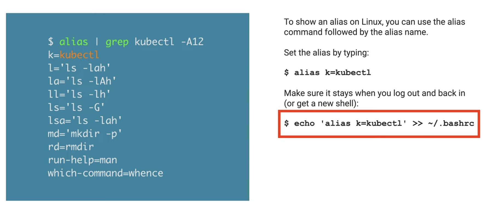
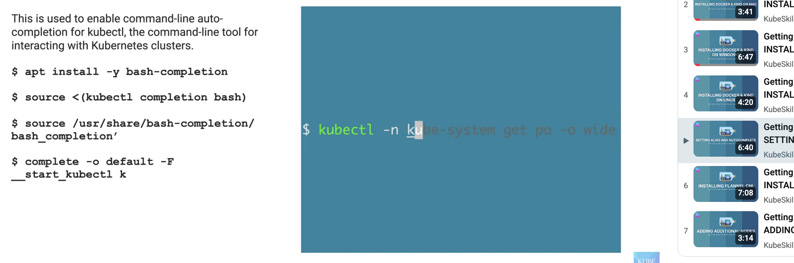

# Kind for k8s

## index 


--- 

## understand Kind ( Kubernetes IN Docker)
- Kind (Kubernetes IN Docker) is an open-source tool for running local Kubernetes clusters using Docker containers as "nodes."
- it uses Docker containers to simulate Kubernetes nodes. 


---


---

## commonly used commands

Grouped by the stage in [TODO.md](../TODO.md) that first needs them. `kind`
itself is a small CLI — `create`, `delete`, `get`, `load`, `export`, `build` is
the whole surface. Almost everything else is `kubectl` or `docker`.

### stage 2 — a cluster the lazy way

```sh
kind create cluster --name [cluster name]        # single node, no config file

# verify
# clusters
kind get clusters                                # every cluster on the machine
kind get clusters --name [cluster name]         
# nodes
kind get nodes
kind get nodes --name [cluster name]             # the containers backing one cluster

# switch
kubectl config current-context                   # kind switches you on create


# delete the created cluster
kind delete cluster --name [cluster name]
```

```sh
docker ps                                 # find the node — it IS a container
docker exec -it k8s-sandbox-control-plane crictl ps
```
> `crictl`, not `docker`: the node runs its own containerd, separate from the host. That separation is what bites in stage 8.

### stage 3 — a cluster you designed

```sh
kind create cluster --config clusters/k8s-sandbox.yaml
kubectl get nodes -w                      # watch NotReady -> Ready
kubectl get pods -n kube-system           # the control plane itself
```

```sh
# who can actually take a pod? control-plane is tainted once workers exist
kubectl get nodes -o custom-columns='NODE:.metadata.name,TAINTS:.spec.taints[*].key'
```

**Recreate, don't patch.** `extraPortMappings` and `disableDefaultCNI` are fixed
at creation. Changing them means `kind delete cluster` then create again.

### stages 4-6 — pods, deployments, services

Ordinary kubectl, nothing kind-specific:

```sh
kubectl run web --image=nginx --dry-run=client -o yaml   # skeleton to edit
kubectl apply -f manifests/02-deployment/
kubectl get pods -o wide                  # -o wide shows the NODE
kubectl describe pod <name>               # Events at the bottom = the story
kubectl logs -f deploy/<name>
kubectl get endpointslices -l kubernetes.io/service-name=<svc>
```

`stern <pattern>` tails many pods at once — easier than `kubectl logs` per pod.

### stage 7 — ingress

```sh
kubectl get pods -n ingress-nginx -o wide  # WHICH NODE? only one has the ports
curl -v http://localhost:8080/             # -v distinguishes refused vs reset
kubectl logs -n ingress-nginx deploy/ingress-nginx-controller
```

### stage 8 — your own image

```sh
docker build -t myapp:dev .
kind load docker-image myapp:dev --name k8s-sandbox     # host image -> node
kind load image-archive myapp.tar --name k8s-sandbox    # from docker save
docker exec -it k8s-sandbox-worker crictl images        # confirm it landed
```

Without the `load`, the kubelet tries to pull `myapp:dev` from Docker Hub and
fails, however clearly `docker images` shows it locally.

### housekeeping

```sh
kind get kubeconfig --name k8s-sandbox        # print it
kind export kubeconfig --name k8s-sandbox     # merge into ~/.kube/config
kind export logs ./kind-logs --name k8s-sandbox   # everything, for a post-mortem
kubectl config get-contexts               # kind-<name> per cluster
kind delete cluster --name k8s-sandbox
```

`kind export logs` is the one to reach for when a cluster misbehaves — it dumps
every node's kubelet, containerd and pod logs into one directory.

---

## compare : kind vs. minikube

Both run real, unmodified Kubernetes — same API server, same objects, same `kubectl`.
The difference is how a "node" gets created and how much convenience is bundled on top.

| | **kind** | **minikube** |
|---|---|---|
| **What a node is** | a Docker container running kubelet + containerd | a VM by default (HyperKit/QEMU/VirtualBox), or a container with `--driver=docker` |
| **Startup / footprint** | faster, lighter — no VM layer | heavier with a VM driver; comparable with the docker driver |
| **Multi-node** | first-class, declared in a YAML cluster config | supported via `--nodes N`, historically less robust |
| **Addons** | none — install ingress, metrics-server, dashboard yourself | built-in catalog: `minikube addons enable ingress / metrics-server / registry / dashboard / csi-hostpath-driver` |
| **NodePort access** | must declare `extraPortMappings` **at cluster creation** — can't add later without recreating | `minikube service <name>` opens it in the browser; no upfront config |
| **LoadBalancer type** | needs MetalLB or cloud-provider-kind | `minikube tunnel`, or the metallb addon |
| **Ingress** | manual ingress-nginx install + port mappings for 80/443 | one addon command |
| **Swapping the CNI** | `disableDefaultCNI: true` in the config, then install Cilium/Calico yourself | `minikube start --cni=calico` (or `cilium`) — one flag |
| **Default storage** | local-path-provisioner ships as the default StorageClass; PVCs work out of the box | built-in storage-provisioner; PVCs work out of the box |
| **Loading local images** | `kind load docker-image myapp:tag` | `minikube image load myapp:tag`, or `eval $(minikube docker-env)` |
| **CI pipelines** | the standard — Kubernetes' own CI uses it; trivial in GitHub Actions | possible but heavier, rarely chosen |
| **Apple Silicon** | fine via Docker Desktop or colima | fine, docker driver recommended |

**Takeaway:** minikube is the friendlier on-ramp (addons handle ingress, LoadBalancer and
port exposure for you); kind is closer to CI and production workflows and forces you to
understand what a NodePort or an ingress controller actually is.

---

## resource

### certificate course 
- [LinuxFoundationX LFS158x | Introduction to Kubernetes](https://learning.edx.org/course/course-v1:LinuxFoundationX+LFS158x+3T2025/block-v1:LinuxFoundationX+LFS158x+3T2025+type@sequential+block@c77f2d1b11234afb9886680612041ab2/block-v1:LinuxFoundationX+LFS158x+3T2025+type@vertical+block@909ea4e51b5a49a5bcf355d44ae11674)

- [Minikube vs Kind: A Comprehensive Comparison](https://betterstack.com/community/guides/scaling-docker/minikube-vs-kubernetes/)
- [Getting Started with KIND Kubernetes](https://www.youtube.com/watch?v=133B-s1YYCA&list=PL1xPpLHBFNWvKPI0ofmFzJn9lrWiqGukT&index=1)


### namual
- [Kind | Quick Start (with package manager)](https://kind.sigs.k8s.io/docs/user/quick-start/#installing-with-a-package-manager)

- [extra : setup alias & autocomplete for k8s commands](https://www.youtube.com/watch?v=7rZgBsBARA0&list=PL1xPpLHBFNWvKPI0ofmFzJn9lrWiqGukT&index=5) 

