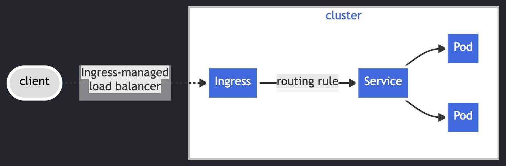
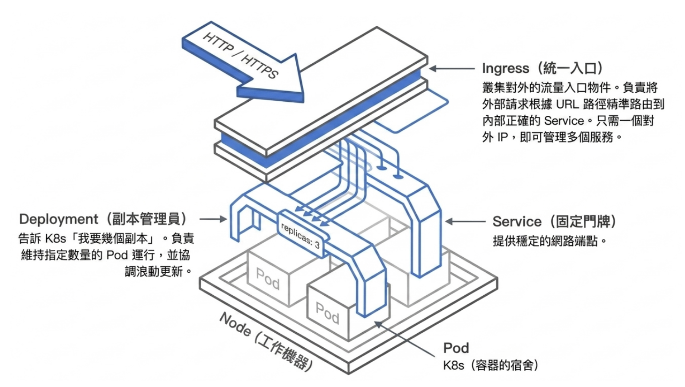

# YAML and Kubernetes manifests

## Index

- [YAML and manifests](#yaml-and-manifests)
- [Notes on syntax](#notes-on-syntax)
   - [Kind port mappings](#kind-port-mappings)
   - [Container ports](#container-ports)
   - [Resources](#resources)
   - [Requests](#requests)
   - [Limits](#limits)
   - [Selectors and templates](#selectors-and-templates)
   - [Readiness probe](#readiness-probe)
   - [Service ports](#service-ports)


---

## YAML and manifests

- `YAML` is the file format.
- A `manifest` is a YAML file that describes a Kubernetes resource's desired state.

For example, a Deployment manifest describes the Pods Kubernetes should manage.

---

## Notes on syntax


```
node 0: role=control-plane  keys=["role", "extraPortMappings", "kubeadmConfigPatches"]
node 1: role=worker         keys=["role"]
node 2: role=worker         keys=["role"]
```

### Kind port mappings
- `extraPortMappings` has nothing to do with the control-plane role. 
- It's there because you plan to run an ingress controller, and that ingress controller happens to be scheduled onto the control-plane node. The full chain is three hops:
```
localhost:8080  →  node container :80  →  ingress-nginx pod's hostPort 80
   (extraPortMappings)                       (set by the ingress manifest)
```
### Container ports

These are TCP port numbers:

- `80`: standard HTTP port inside the Kind node
- `8080`: port on the Mac exposed by Kind for HTTP access
- `443`: standard HTTPS port inside the Kind node
- `8443`: port on the Mac exposed by Kind for HTTPS access

The mappings are:

```text
localhost:8080  ->  Kind node:80
localhost:8443  ->  Kind node:443
```

Port `8080` is used instead of host port `80`, and `8443` instead of host port
`443`, to avoid privileged-port requirements and conflicts with other services
on the Mac. The mappings only create the path; the Ingress controller must
listen on ports `80` and `443` inside the node before requests can succeed.


### Resources

The `resources` field describes how much CPU and memory a container is
expected to use. It has two main parts: `requests` and `limits`.

```yaml
resources:
   requests:
      cpu: "100m"
      memory: "128Mi"
   limits:
      memory: "256Mi"
```

### Requests

A request is the amount of CPU or memory Kubernetes reserves for scheduling.
The scheduler compares the request with the resources already requested on each
node. If a node cannot satisfy the request, the Pod stays `Pending`.

- `100m` CPU : means `0.1` CPU core.
- `128Mi` : means 128 mebibytes of memory.
- A request should represent normal or expected usage.

Requests are not a live usage measurement and are not a guarantee that the
container will always consume exactly that amount.

### Limits

- the max resource the container may use while running. 
- a memory limit is enforced at runtime: if the container exceeds it, Kubernetes may terminate it with an out-of-memory kill. 
- The scheduler does not reserve node capacity from a limit; it uses requests for that decision.

```text
request: reserve capacity for scheduling
limit:   cap usage during runtime
```

- The limit should normally be *greater* than the request so the container can handle short bursts. 
- A request that is too small -> can cause a node to be overpacked, while a limit that is too small can cause restarts. 
- These values are not arbitrary in production- > measure the application and adjust them.

### Selectors and templates

A Deployment's selector identifies the Pods it manages. The selector must match
the labels in the Pod template:

```yaml
selector:
   matchLabels:
      app: nginx
template:
   metadata:
      labels:
         app: nginx
```

If these labels do not match, Kubernetes rejects the Deployment or the
Deployment cannot manage the intended Pods.

The `template` is the reusable Pod blueprint. It includes the container image,
resources, probes, environment, and other Pod settings used when creating or
replacing replicas.

### Readiness probe

A `readinessProbe` tells Kubernetes whether a running container is ready to
receive traffic. It is different from whether the container process is alive:

```yaml
readinessProbe:
   httpGet:
      path: /
      port: 80
   initialDelaySeconds: 5
   periodSeconds: 5
```

- `httpGet`: make an HTTP request to test the container.
- `path: /`: request the root URL served by Nginx.
- `port: 80`: send the request to the container's HTTP port.
- `initialDelaySeconds: 5`: wait five seconds before the first check.
- `periodSeconds: 5`: repeat the check every five seconds.

If the check succeeds, the Pod is `Ready` and a Service may send it traffic.
If it fails, the container can remain `Running` but the Pod becomes not Ready,
so Services remove it from their ready endpoints. A failed readiness probe does
not restart the container; a liveness probe is used for restart decisions.


### Service ports

A Service provides a stable address and forwards traffic to selected Pods:

```yaml
ports:
   - protocol: TCP
      port: 80
      targetPort: 80
```

- `port`: the port exposed by the Service inside the cluster.
- `targetPort`: the port on the selected Pod/container receiving traffic.
- `protocol: TCP`: explicit here, although TCP is the default.

For Nginx, both values are `80` because Nginx listens on HTTP port `80`.
The Service selects Pods using labels, for example `app: nginx`, and normally
routes only to Pods whose readiness probe has succeeded.

### type

`type` controls how a Service is exposed:

- `ClusterIP` exposes the Service only inside the Kubernetes cluster. It is the
   default type.
- `LoadBalancer` asks an external load-balancer implementation for an external
   IP. In a cloud, a cloud controller usually creates the load balancer.

In Kind there is no cloud load-balancer provider, so `LoadBalancer` normally
stays pending:

```text
NAME    TYPE           CLUSTER-IP      EXTERNAL-IP   PORT(S)
nginx   LoadBalancer   10.96.236.115   <pending>     80:32037/TCP
```

This still means the Service object was accepted and its ClusterIP remains.
The `80:32037/TCP` output means the Service also received a NodePort, in this
case `32037`. The external IP is pending because Kind does not automatically
provide an external load balancer.

MetalLB supplies that missing implementation for local or bare-metal clusters.
It assigns an IP from a configured address pool and advertises it on the local
network. The Service selector and EndpointSlices still determine which Pods
receive the traffic.

Restore the local Service after the experiment:

```yaml
type: ClusterIP
```

```bash
kubectl apply -f manifests/base/ngnix/service.yaml
kubectl get service nginx
```


---

## service.yaml

A Service has 2 independent parts:

```text
Service object + ClusterIP + DNS
            still exists

Selector -> matching ready Pods
            can be empty
```

- The Service object provides the stable name and ClusterIP.
- The selector finds Pods whose labels match, such as `app: nginx`.
- EndpointSlices record the matching ready Pod IP addresses.
- A Service can exist and resolve through DNS while having no endpoints.

That is why a Service can resolve correctly while traffic fails: a wrong
selector may match no ready Pods. EndpointSlices are the first thing to check
when a Service does not work.

The failure experiment is:

```yaml
# broken Service selector
selector:
   app: wrong
```

```bash
kubectl apply -f manifests/base/ngnix/service.yaml
kubectl get service nginx
kubectl get endpointslices \
   -l kubernetes.io/service-name=nginx
```

The Service should still exist, while its EndpointSlice has no endpoints.
Restore the selector and apply again:

```yaml
selector:
   app: nginx
```

The Pod IP addresses should return to the EndpointSlice. After observing both
states, the selector experiment is complete.

When the selector is wrong:

```yaml
selector:
   app: wrong
```

The Service itself is still successfully created:

```bash
kubectl get service nginx
```

It still has:

- Service name: `nginx`
- ClusterIP: `10.96.x.x`
- DNS name: `nginx.default.svc.cluster.local`

But it has no matching Pods, so:

```bash
kubectl get endpointslices \
   -l kubernetes.io/service-name=nginx
```

shows no endpoints.

```text
Service created successfully -> yes
Service DNS resolves         -> yes
Matching backend Pods        -> no
Application traffic works    -> no
```

A successful `kubectl apply` only confirms that the Service object was accepted
by the API server. It does not prove that the Service has healthy Pods behind
it. That is why EndpointSlices are important.

---

## ingress 
Ingress exposes HTTP and HTTPS routes from outside the cluster to services within the cluster. Traffic routing is controlled by rules defined on the Ingress resource.




--- 
## resources / manual 

- [7 Kubernetes deployment strategies: Pros, cons, and how to choose](https://octopus.com/devops/kubernetes-deployments/kubernetes-deployment-strategies/)
- [Services in Kubernetes](https://kubernetes.io/docs/concepts/services-networking/service/)
- [Ingress](https://kubernetes.io/docs/concepts/services-networking/ingress/)